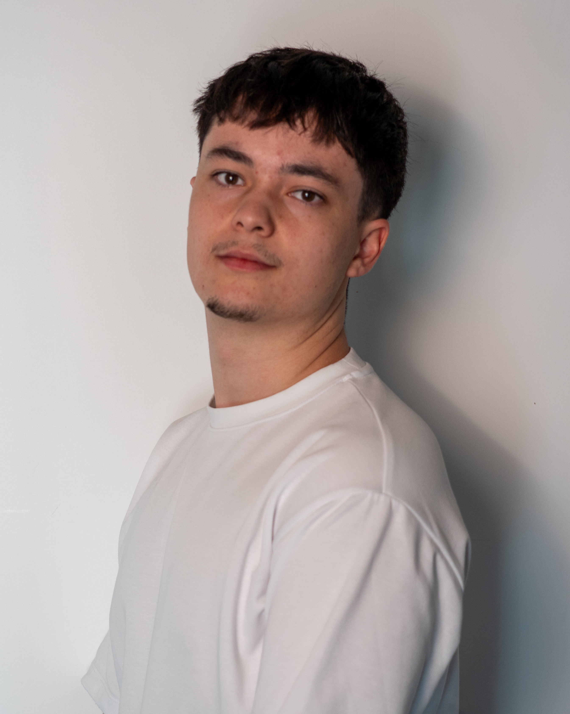

  

  
  
  

  

---

### 🧑‍💻 About Me

- 🔬 **Data Scientist intern @ Michelin** (Roanne, France)
- 🎓 BSc **Data Science**, 3rd year @ **Ynov Campus Lyon** (2023–2026)
- 🧠 Into **Machine Learning & Deep Learning** — RNN, LSTM, CNN, computer vision
- ⛷️ Former competitive skier, now a lifeguard — discipline on and off the keyboard
- 🌍 Open to **data / ML internships and work-study opportunities**

---

### 🛠️ Tech Stack

---

### 🚀 Featured Projects

#### 📊 Data Science & Machine Learning
- 🛰️ **[Sentinel](https://github.com/CalvoTom/Sentinel)** — Surveillance video analysis with deep learning (RNN / skeleton-based behavior detection).
- 🚀 **[Spaceship Titanic Challenge](https://github.com/CalvoTom/Spaceship-Titanic-Challenge)** — Kaggle competition submission with feature engineering & ML models.
- 🔬 **[Histopathologic Cancer Detection](https://github.com/CalvoTom/Histopathologic-Cancer-Detection-Challenge)** — CNN-based image classification on medical imaging.
- 🌫️ **[AirQuality](https://github.com/CalvoTom/AirQuality)** — Air quality data analysis & modeling.
- 📈 **[Prisme](https://github.com/CalvoTom/Prisme)** — Data exploration & analytics notebook project.

#### ⚙️ DevOps
- 🔄 **[DevOps CI/CD](https://github.com/CalvoTom/DevOps-Cours-CI-CD-)** — Continuous integration & deployment pipelines.
- 🧪 **[TP Final DevOps](https://github.com/CalvoTom/TP-Final-DevOps)** — End-to-end DevOps project (build, test, deploy).
- 🐍 **[Python DevOps Double Version](https://github.com/CalvoTom/Python-devops-double-version)** — Multi-version Python app with DevOps tooling.

---

### 📈 GitHub Stats

  
  

  

  

---

  

